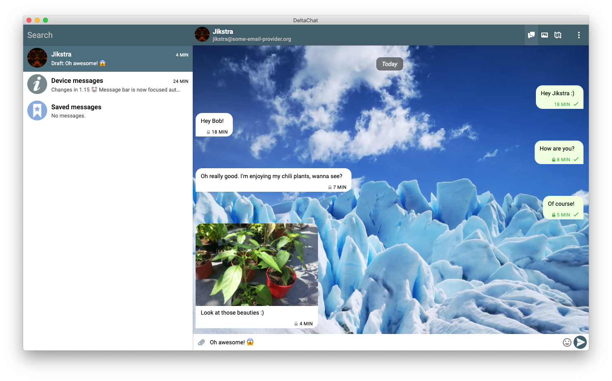

[](https://github.com/prettier/prettier)

# Delta Chat Desktop <a id="deltachat-desktop"></a>

**Desktop Application for [delta.chat](https://delta.chat)**

<center></center>

## Documentation Links <a id="docs"></a>

<table>
  <thead>
    <tr><th>For Users</th><th>For Developers</th></tr>
  </thead>
<tbody>
<tr><td>

[TROUBLESHOOTING](./docs/TROUBLESHOOTING.md)

[CLI flags](./docs/CLI_FLAGS.md)

[Keybindings](./docs/KEYBINDINGS.md)

[How to make custom Themes](./docs/THEMES.md)

</td><td>

[Logging](./docs/LOGGING.md)

[Documentation for Developers](./docs/DEVELOPMENT.md)

[Styling Guidelines](./docs/STYLES.md)

[How to update core](./docs/UPDATE_CORE.md)

[How to do end to end testing](./docs/E2E-TESTING.md)

[How to do a release](./docs/RELEASE_WORKFLOW.md)

</td>
</tr>
</tbody>
</table>

## Table of Contents

<details><summary>Click to expand</summary>

- [deltachat-desktop](#deltachat-desktop)
  - [Documentation Links](#docs)
  - [Table of Contents](#table-of-contents)
  - [Install](#install-)
    - [Linux](#linux-)
      - [Flatpak](#flatpak-)
      - [Arch Linux](#arch-linux-)
    - [MacOS](#mac-os-)
      - [Homebrew](#homebrew)
      - [DMG](#dmg)
    - [Windows](#windows)
    - [From Source](#from-source-)
    - [Troubleshooting](#troubleshooting-)
  - [Configuration and Databases](#configuration-and-databases-)
  - [How to Contribute](#how-to-contribute-)
  - [Logging](#logging-)
  - [License](#license-)

</details>

## Install <a id="install"></a>

The application can be downloaded from **<https://get.delta.chat>**. Here you'll find binary releases for all supported platforms. See below for platform specific instructions. If you run into any problems please consult the [Troubleshooting](#troubleshooting) section below.

### Linux <a id="linux"></a>

#### Flatpak <a id="flatpak"></a>

The primary distribution-independed way to install is to use the
flatpak build.
This is maintained in [it's own
repository](https://github.com/flathub/chat.delta.desktop), however a
pre-built binary can be downloaded and installed from
[flathub](https://flathub.org/apps/details/chat.delta.desktop) which
also has a setup guide for many Linux platforms.

#### Arch Linux <a id="arch-linux"></a>

> **WARNING: Currently the AUR package compiles from latest master. This can be more recent as the latest release, introduce new features but also new bugs.**

If you have a AUR helper like yay or paru installed, you can install it by running `yay -S deltachat-desktop-git` and following the instruction in your terminal.

Otherwise you can still do it manually:

<details>
<summary>Show manual steps</summary>

```sh
# Download the latest snapshot of the PKGBUILD
wget https://aur.archlinux.org/cgit/aur.git/snapshot/deltachat-desktop-git.tar.gz

# extract the archive and rm the archive file afterwards
tar xzfv deltachat-desktop-git.tar.gz && rm deltachat-desktop-git.tar.gz

# cd into extracted folder
cd deltachat-desktop-git

# build package
makepkg -si

# install package (you need to replace <version> with whatever version makepkg built)
sudo pacman -U deltachat-desktop-git-<version>.tar.xz
```

</details>

### Mac OS <a id="mac"></a>

#### Homebrew

```
$ brew install --cask deltachat
```

#### DMG

Simply install the `.dmg` file as you do it with all other software on mac.

### Windows <a id="windows"></a>

You can find the downloads for windows on <https://get.delta.chat>, though we recomend using the [Microsoft Store release](https://www.microsoft.com/en-us/p/deltachat/9pjtxx7hn3pk?activetab=pivot:overviewtab), because there you get automatic updates.

### From Source <a id="source"></a>

> ⚠ This is mostly for development purposes, this won't install/integrate deltachat into your system.
> So unless you know what you are doing, we recommend to stick to the methods above if possible.

```sh
# Get the code
$ git clone https://github.com/deltachat/deltachat-desktop.git
$ cd deltachat-desktop

# Install dependencies
$ npm install

# Build the app (only needed on the first time or if the code was changed)
$ npm run build

# Start the application:
$ npm start
```

For development with local deltachat-core read the [docs](docs/UPDATE_CORE.md)

### Troubleshooting <a id="troubleshooting"></a>

This module builds on top of [`deltachat-core-rust`](https://github.com/deltachat/deltachat-core-rust), which in turn has external dependencies. The instructions below assume a Linux system (e.g. Ubuntu 18.10).

If you get errors when running `npm install`, they might be related to the _build_ dependency `rust`.

If `rust` or `cargo` is missing:
Follow the instruction on <https://rustup.rs/> to install rust and cargo.

Then try running `npm install` again.

Make sure that your nodejs version is `16.0.0` or newer.

If you still get errors look at the instructions in the [`deltachat-node`](https://github.com/deltachat/deltachat-core-rust/tree/master/node) and [`deltachat-core-rust`](https://github.com/deltachat/deltachat-core-rust) README files to set things up [`or write an issue`](https://github.com/deltachat/deltachat-desktop/issues/new/choose).

## Configuration and Databases <a id="config-and-db"></a>

The configuration files and database are stored at [application-config's default file paths](https://www.npmjs.com/package/application-config#config-location).

Each database is a SQLite file that represents the account for a given email address.

## How to Contribute <a id="how-to-contribute"></a>

Read [docs/DEVELOPMENT.md](docs/DEVELOPMENT.md)

For translations see our transifex page: https://www.transifex.com/delta-chat/public/

For other ways to contribute: https://delta.chat/en/contribute

## Logging <a id="logging"></a>

You can access the log folder and the current log file under the `View->Developer` menu:

<center></center>

Read [docs/LOGGING.md](docs/LOGGING.md) for an explanation about our logging system. (available **options**, log **location** and information about the used Log-**Format**)

## License <a id="license"></a>

Licensed under `GPL-3.0-or-later`, see [LICENSE](./LICENSE) file for details.

> Copyright © 2019 `DeltaChat` contributors.

> This program is free software: you can redistribute it and/or modify
> it under the terms of the GNU General Public License as published by
> the Free Software Foundation, either version 3 of the License, or
> (at your option) any later version.

> This program is distributed in the hope that it will be useful,
> but WITHOUT ANY WARRANTY; without even the implied warranty of
> MERCHANTABILITY or FITNESS FOR A PARTICULAR PURPOSE. See the
> GNU General Public License for more details.

> You should have received a copy of the GNU General Public License
> along with this program. If not, see <http://www.gnu.org/licenses/>.
