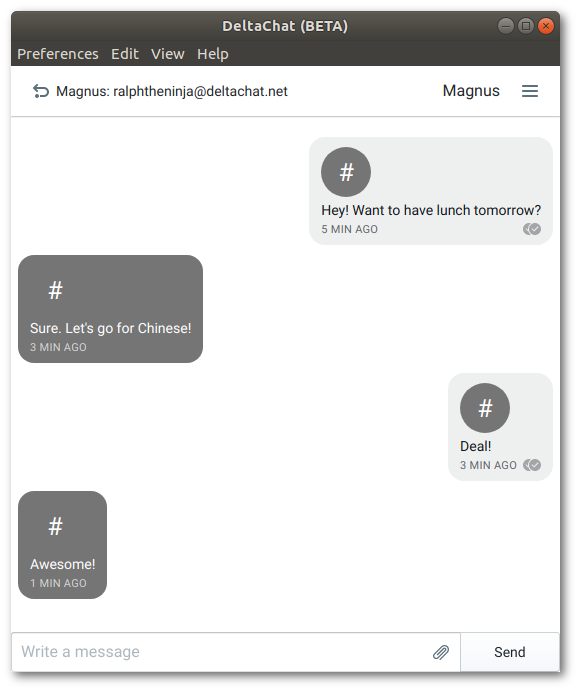
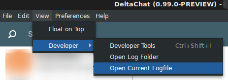

# deltachat-desktop

**Desktop Application for [delta.chat](https://delta.chat)**

[](https://travis-ci.org/deltachat/deltachat-desktop)
[](https://standardjs.com)

<center></center>

**If you are upgrading:** please see [`UPGRADING.md`](UPGRADING.md).

## Table of Contents

<details><summary>Click to expand</summary>

- [Install](#install)
- [Configuration and Databases](#configuration-and-databases)
- [Troubleshooting](#troubleshooting)
- [How to Contribute](#how-to-contribute)
- [License](#license)

</details>

## Install

The application can be downloaded from the [`Releases`](https://github.com/deltachat/deltachat-desktop/releases) page. Here you'll find prebuilt releases for all supported platforms. See below for platform specific instructions. If you run into any problems please consult the [Troubleshooting](#troubleshooting) section below.

### Linux

#### AppImage

AppImages are a generic way to install software accross most linux distributions
and systems.

To install a `.AppImage` based release:

- Download the binary
- Make it executable, e.g. `chmod u+x ~/Downloads/deltachat-desktop-x.y.z-x86_64.AppImage`
- Executing the `.AppImage` will install it on the system in `/opt/DeltaChat`

#### Debian/Ubuntu

- Click on the link for the `.deb` file
- Some systems enable installing it directly by clicking
- If your system doesn't handle `.deb` files you can install manually by doing e.g. `sudo dpkg -i ~/Downloads/deltachat-desktop_x.y.z_amd64.deb`

#### Arch Linux

**WARNING: Currently the AUR package compiles from latest master. This can be more recent as the latest release, introduce new features but also new bugs.**

If you have a AUR helper like yay installed, you can install it by running `yay -S deltachat-desktop-git` and following the instruction in your terminal.

Otherwise you can still do it manually:

```
# Download the latest snapshot of the PKGBUILD
wget https://aur.archlinux.org/cgit/aur.git/snapshot/deltachat-desktop-git.tar.gz
# extract the archive and rm the archive file afterwards
tar xzfv deltachat-desktop-git.tar.gz && rm deltachat-desktop-git.tar.gz
# cd into extracted folder
cd deltachat-desktop-git
# build package
makepkg -si
# install package (you need to replace <version> with whatever version makepkg built)
sudo pacman -U deltachat-desktop-git-<version>.tar.xz
```

#### Mac OS

Simply install the `.dmg` file as you do it with all other software on mac.

If you are getting an openssl error message at the first start up you need to install openssl.

```
$ brew install openssl
```

### From Source

Get the code:

```
$ git clone https://github.com/deltachat/deltachat-desktop.git
$ cd deltachat-desktop
```

Install dependencies:

```
$ npm install
```

Build the app (only needed if the code has changed or if the app has never been built before):

```
$ npm run build
```

Start the application:

```
$ npm start
```

## Configuration and Databases

The configuration files and database are stored at [application-config's default filepaths](https://www.npmjs.com/package/application-config#config-location).

Each database is a sqlite file that represents the account for a given email address.

## Troubleshooting

This module builds on top of `deltachat-core`, which in turn has external dependencies. Instructions below assumes a Linux system (e.g. Ubuntu 18.10).

If you get errors when running `npm install`, they might be related to the _build_ dependencies `meson` and `ninja`.

If `meson` is missing:

```
sudo apt-get install python3-pip
sudo pip3 install meson
```

If `ninja` is missing:

```
sudo apt-get install ninja-build
```

You might also need the following system dependencies:

- `libssl-dev`
- `libsasl2-dev`
- `libsqlite3-dev`
- `zlib1g-dev`

To fix these issues do:

```
sudo apt-get install libssl-dev libsasl2-dev libsqlite3-dev zlib1g-dev
```

Then try running `npm install` again.

Please see [build instructions](https://github.com/deltachat/deltachat-core#building-your-own-libdeltachatso) for additional information.

### Logging

#### Logging Options

Debug messages are disabled by default, enable them with the `--log-debug` flag.

| Flag               | Effect                                       |
| ------------------ | -------------------------------------------- |
| `--log-debug`      | Log debug messages                           |
| `--log-to-console` | Output the log to stout / chrome dev console |

#### Log locations

The logs can be found in:

```
Linux: ~/.config/DeltaChat/logs/
Mac: ~/Library/Application Support/DeltaChat/logs
```

You can also access the log folder and the current log file under the `View->Developer` menu:

<center></center>

##### Format

The log files have the extension `.log`, the file name represents the point in time the log started.
Basically the log files are **tab separated** `csv`-files:

```
"2019-01-27T13:46:31.801Z"	"main/deltachat"	"INFO"	[]	"dc_get_info"
```

| timestamp                  | location / module | level  | stacktrace | arg1          | arg2 | ... |
| -------------------------- | ----------------- | ------ | ---------- | ------------- | ---- | --- |
| "2019-01-27T13:46:31.801Z" | "main/deltachat"  | "INFO" | \[]        | "dc_get_info" | -    | ... |

## How to Contribute

### Code Structure

Some important folders and files:

```
├── bin                       # various helper scripts
├── build                     # files needed only at build time
├── css                       # styelsheets which need preprocessing
│   └── conversations         # stylesheets pulled out from signal
├── images                    # image files used in conversations
├── index.js                  # entry point for the main process
├── jenkins                   # pipelines for building on Jenkins
├── _locales                  # translation files in xml and json
│   ├── _experimental-en.json # can contain experimental language strings
│   └── languages.json        # central file which keeps the human readable language names
├── src
│   ├── main                  # javascript for the main process
│   └── renderer              # javascript for the renderer process
├── static
│   ├── bundle.js             # javascript bundle built by webpack
│   └── conversations.css     # css bundle built from conversations scss files
│   ├── fonts                 # fonts
│   ├── main.css              # main css file
│   └── main.html             # main html file in renderer process
├── test
│   ├── integration           # integration tests
│   └── unit                  # unit tests
├── .travis.yml               # build script for Travis
├── .tx                       # configuration for Transifex
└── webpack.config.js         # configuration for webpack
```

### Run the Code

While developing the following command will build the app and start `electron` in debug mode with http cache disabled:

```
$ npm run dev
```

It's also handy to run this watch command in a separate terminal

```
$ npm run watch
```

### Add experimental language strings

Sometimes you need to add new language strings, but don't want to push them to
transifex immediately because it's unsure if the string will be adjusted in the
short future or it's unclear if the pr will even get merged or you simply don't
have push rights to the transifex language repo. To still be able to implement
new language strings, you can add them to the `_locales/_experimental-en.json`
file. You can also overload every other language string if you need to.
The syntax is the exact same as for all other `_locales/*.json` files. 

Example:
`{"foobar_desktop": {"message": "This is a test"}}`

### Tests

Running `npm test` does the following:

- runs `standard` as code linter
- runs the unit tests

Running `npm run test-integaration` executes the integration tests.

The integration tests use `spectron` and `tape`. They click through the app, taking screenshots and comparing each one to a reference. Why screenshots?

- Ad-hoc checking makes the tests a lot more work to write
- Even diffing the whole HTML is not as thorough as screenshot diffing. For example, it wouldn't
  catch an bug where hitting ESC from a video doesn't correctly restore window size.
- Chrome's own integration tests use screenshot diffing iirc
- Small UI changes will break a few tests, but the fix is as easy as deleting the offending
  screenshots and running the tests, which will recreate them with the new look.
- The resulting Github PR will then show, pixel by pixel, the exact UI changes that were made! See
  <https://github.com/blog/817-behold-image-view-modes>

For MacOS, you'll need a Retina screen for the integration tests to pass. Your screen should have the same resolution as a 2016 12" Macbook.

For Windows, you'll need Windows 10 with a 1366x768 screen.

When running integration tests, keep the mouse on the edge of the screen and don't touch the mouse or keyboard while the tests are running.

### Translations

Install the [transifex-client](https://docs.transifex.com/client) and get added to the `Delta Chat App` project.

And periodically we can run the following command to get the new translation strings from translators:

```
tx pull --all
```

Note that this command updated `_locales/*.xml`. Run the following command to convert from xml to json:

```
npm run build-translations
```

When you need to modify language strings, this should be done in `_locales/en.xml`. Run the following command to sync with Transifex:

```
tx push --source
```

### CI

For Continuous Integration we currently use both Travis and Jenkins. Travis is used for Mac and Jenkins for Linux. Once we support Windows we will most likely use Travis for Windows.

### Deploy Workflow

1. Create a draft release on github, e.g. `vX.Y.Z`
2. Change `version` field in `package.json` to `X.Y.Z`
3. Commit and push modified `package.json` (repeat until release is ready)
4. Once done, publish the release on github, which will create the tag

Also see <https://www.electron.build/configuration/publish>

## License

Licensed under the GPLv3, see [LICENSE](./LICENSE) file for details.

Copyright © 2019 `DeltaChat` contributors.
