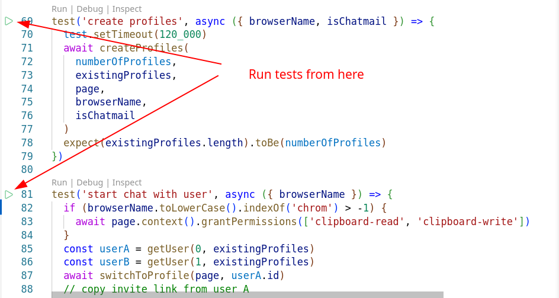

# End to end tests

## Install playwright

after running `pnpm install`

cd into packages/e2e-tests and run `npx playwright install --with-deps`

Copy packages/e2e-tests/\_env to packages/e2e-tests/.env

A convenient alternative to install and use playwright is the VSCode [plugin](https://playwright.dev/docs/getting-started-vscode). It also provides some functionality for running or recording tests.



Be aware that the tests in each spec file are NOT isolated, so the order they are executed matters. Otherwise we would have to create and delete all profiles and preparations for each test which would slow down all tests dramatically.

## Usage

This package depends on the target-browser so make sure you prepared that to run (adding custom certificates). See [README](../packages/target-browser/Readme.md)

But don't run the browser at the same time, it will be started inside the test routine.

```sh
pnpm -w e2e
```

for headless usage

or

```sh
pnpm -w e2e --ui
```

for [UI mode](https://playwright.dev/docs/test-ui-mode)

```sh
pnpm -w e2e basic
```

to run only tests in file basic-tests.spec.ts (all tests that match by second parameter)

or

```sh
pnpm -w e2e --project=non-chatmail
```

to run all tests with option chatmail = false (to use non chatmail server)

```sh
pnpm -w --filter e2e-tests e2e:report
```

to show the last report

The account dir for tests is in _packages/e2e-tests/data/accounts_ (configurable in .env)

It can be deleted after running tests and will be recreated in the next run.

## Troubleshooting

Make sure that there are no accounts left after fail.
`rm -r packages/e2e-tests/data/accounts`

After failing tests or stopping tests with Ctrl + C sometimes either the rpc-server process is still running or the used port is still blocked by a process
To find the related process pid (on Linux) run:

`ps -aef | grep rpc-server` or for the process blocking the port:

`lsof -i:3000`
