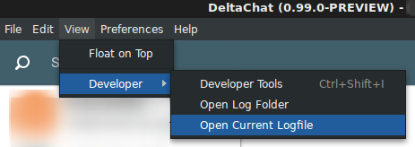

### Logging

#### Logging Options

Debug messages are disabled by default, enable them with the `--log-debug` flag.

| Flag                            | Effect                                       |
| ------------------------------- | -------------------------------------------- |
| `--log-debug`                   | Log debug messages                           |
| `--log-to-console`              | Output the log to stout / chrome dev console |
| `--machine-readable-stacktrace` | Enable JSON stacktrace                       |
| `--no-color`                    | Disable colors in the output of main process |

> as of 1.3.0 `--debug` enables both `--log-debug` and `--log-to-console`

#### Log locations

The logs can be found in:

```
Linux: ~/.config/DeltaChat/logs/
Mac: ~/Library/Application\ Support/DeltaChat/logs
```

You can also access the log folder and the current log file under the `View->Developer` menu:

<center></center>

##### Format

The log files have the extension `.log`, the file name represents the point in time the log started.
Basically the log files are **tab separated** `csv`-files(also known as `tsv`):

```
"2019-01-27T13:46:31.801Z"	"main/deltachat"	"INFO"	[]	"dc_get_info"
```

| timestamp                  | location / module | level  | stacktrace | arg1          | arg2 | ... |
| -------------------------- | ----------------- | ------ | ---------- | ------------- | ---- | --- |
| "2019-01-27T13:46:31.801Z" | "main/deltachat"  | "INFO" | \[]        | "dc_get_info" | -    | ... |
