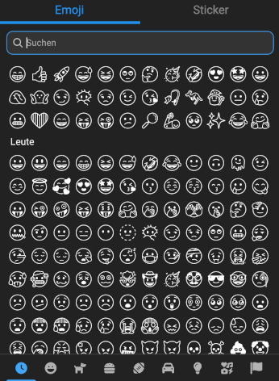

## Information how the experimental theme system works

Themes are CSS files that act as themes by containing many different css variables.

Most of these variables are small variations of the base colors of the theme so using scss allows us to generate them from the base colors to save us work.
But of course we can overwrite those variables manually too, we can even overwrite css classes if our theme needs it.

## Theme codes

There are two types of themes `dc`(built-in) and `custom` themes.
DeltaChat Desktop searches in two places for themes, the theme folder contained in the deltachat installation and the theme folder in the deltachat user data folder of the users account (custom themes).

The actual theme code is build as follows:

```
[location/type]:[name of theme file without extension]
```

Some examples:

```
dc:dark -> ./themes/dark.css
dc:light -> ./themes/light.css
custom:mytheme -> ~/.config/DeltaChat/custom-themes/mytheme.css
```

There is a special code that is an exception to this: `system` it gets translated into `dc:dark` or `dc:light` depending on the system theme of the host OS.

## Setting a theme from CLI

> Warning: This will also (probably) change in the future.

```
npx electron . --theme dc:dark
or
npm run dev -- --theme dc:dark
or
npm run start -- --theme dc:dark
```

You can also enable hot reload for loaded theme with:

```
npm run start -- --theme dc:dark --theme-watch
```

## Creating your own Theme:

We use SCSS to create themes, because it allows us to save work by using its color transformation functions (such as `lighten` or `darken`)

### **Method A** - When you have a deltachat desktop checkout

0. make sure deltachat desktop is up to date and checked out to the version you want to make your theme for, normally checking out master is sufficient for making themes for the newest version.

1. copy the light or dark theme and save it to your user deltachat folder `DeltaChat/custom-themes/my_theme.scss`

2. run `npm i`

3. compile the theme to CSS in watch mode.

```sh
npx sass --watch path/to/Deltachat/config/folder/custom-themes/my_theme.scss path/to/Deltachat/config/folder/custom-themes/my_theme.css -I themes/ --no-source-map
# for linux
npx sass --watch ~/.config/DeltaChat/custom-themes/my_theme.scss ~/.config/DeltaChat/custom-themes/my_theme.css -I themes/ --no-source-map
```

> Note: you have to set `-I` to the theme folder in a deltachat-desktop git checkout, otherwise you'll get an error!

4. open a new terminal window/tab

5. start deltachat from your terminal with your theme selected in watch mode:

```sh
deltachat --theme custom:my_theme --theme-watch
```

6. Open your theme file in your favorite code/text editor and edit it,
   when you save it your changes should be applied 1-2 seconds later.

Read the comments in the theme files for additional information.

### **Method B** - Without cloning the whole deltachat desktop

0. install the sass compiler via `npm i -g node-sass` (if it says that npm was not found, then you need to install nodejs first)

1. Download all files starting with `_` from https://github.com/deltachat/deltachat-desktop/tree/master/themes and put them in a `./themes/` folder in your working directory (or alternatively download the folder to your working directory).

2. copy the light or dark theme and save it to your user deltachat folder `DeltaChat/custom-themes/my_theme.scss`

3. compile the theme to CSS in watch mode.

```sh
node-sass -w path/to/Deltachat/config/folder/custom-themes/my_theme.scss path/to/Deltachat/config/folder/custom-themes/my_theme.css --include-path path/to/deltachat-desktop-git-folder/themes/
# for linux:
node-sass -w ~/.config/DeltaChat/custom-themes/my_theme.scss ~/.config/DeltaChat/custom-themes/my_theme.css --include-path themes/
```

> Note: you have to set `--include-path` to the theme folder you created or downloaded earlier in step 1.

4. open a new terminal window/tab

5. start deltachat from your terminal with your theme selected in watch mode:

```sh
deltachat --theme custom:my_theme --theme-watch
```

6. Open your theme file in your favorite code/text editor and edit it,
   when you save it your changes should be applied 1-2 seconds later.

Read the comments in the theme files for additional information.

## Special variables for theming

Some theming requires the javascript code to know how it should behave, for this purpose we have some css vars that are read by the javascript of the app:

```scss
/* the chatlist is virtualized so the js needs to know the item height */
--SPECIAL-chatlist-item-chat-height: 64;
--SPECIAL-chatlist-item-contact-height: 64;
--SPECIAL-chatlist-item-message-height: 64;
--SPECIAL-chatlist-divider-height: 50;
/* emoji picker icon style */
--SPECIAL-emoji-picker-category-icon-style: solid; /* solid | outline */
```

## Hidden prototype themes with `dev_`

Themes can be hidden in production mode:
When their filename is prefixed with `dev_` they won't show up in the theme selection unless they are selected or `--devmode` is active.

# Guide: Changing the emoji font

So let's say we have our own emoji font, in my case it's the mono color version of google's noto emojis.

The first step is to aquire your prefered emoji font, then save it somewhere where it will not be acidentially deleted (for example you could install it as a system font).

Then overwrite the `"EmojiMart"` font family at the end of your theme.scss file like shown here:

```scss
/* overwrite css */

@font-face {
  font-family: 'EmojiMart';
  /* use the absolute path */
  src: url('/absolute/path/to/NotoEmoji-Medium.ttf') format('truetype');
  /* or if you installed it use the name under which it was installed */
  /* If your font name does not work, make sure it is the 'PostScript-Name' of the font */
  src: local('NotoEmoji-Regular');
  /* don't forget to remove the src that you don't need there should only be one */
}
```

Now build your theme (see sections above on how to do that), select your custom theme in detachat and then enjoy the new look of your emojis:


